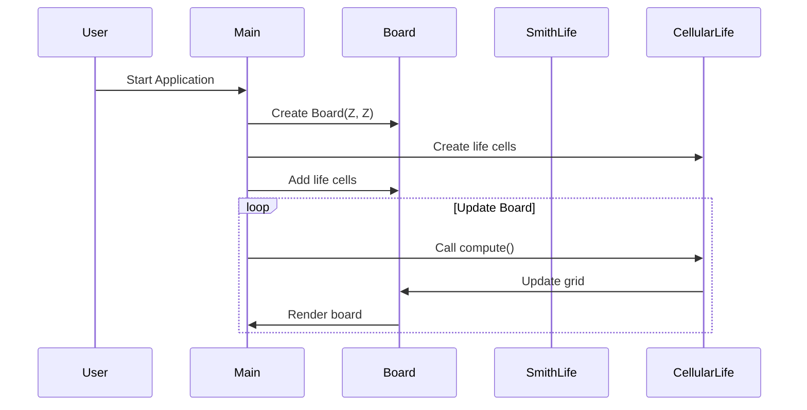

# CellViz
Cellular Automata (inspired by live-data) in order to visualize multidimensional & high-throughput data.

```mermaid
sequenceDiagram
    participant User
    participant Main
    participant Board
    participant SmithLife

    User->>Main: Start Application
    Main->>Board: Create Board(Z, Z)
    Main->>CellularLife: Create life cells
    Main->>Board: Add life cells
    loop Update Board
        Main->>CellularLife: Call compute()
        CellularLife->>Board: Update grid
        Board->>Main: Render board
    end
```