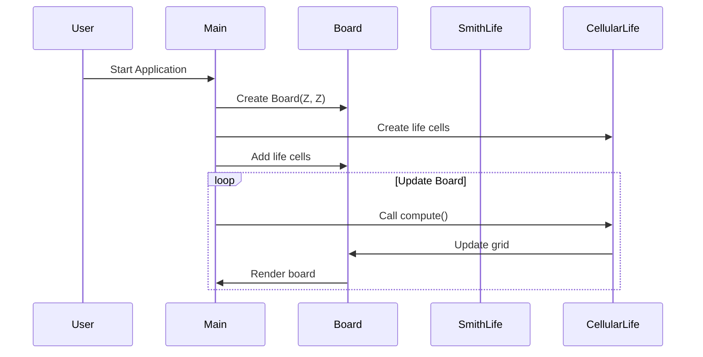

# CellViz

[](https://github.com/velocitatem/CellViz/releases) [](https://opensource.org/licenses/MIT) [](https://github.com/velocitatem/CellViz/actions) [](https://en.wikipedia.org/wiki/C%2B%2B) [](https://ubuntu.com/)

Cellular Automata inspired by live-data visualization, designed to handle multidimensional and high-throughput data efficiently.

## Authors


## Requirements

To build and run CellViz, you will need:

- Boost dev libraries (not runtime)
- JsonCpp dev libraries
- Nlohmann Json dev libraries
- CMake
- SFML
- Alpha Vantage API Key

### Installation on Ubuntu

```bash
sudo apt update
sudo apt-get install libboost-all-dev libjsoncpp-dev nlohmann-json3-dev libsfml-dev
```

To use the Alpha Vantage API key, set the environment variable:

```bash
export API_KEY=YOUR_ALPHA_VANTAGE_KEY
```

## Project Structure



## Features

- Visualizes cellular automata for high-throughput, multidimensional data.
- Implements live-data feeds with Alpha Vantage integration.
- Built with C++ and optimized for performance.
- Modular architecture for easy addition of new data types.

## Getting Started

Clone the repository:

```bash
git clone https://github.com/velocitatem/CellViz.git
```

Navigate to the project directory:

```bash
cd CellViz
```

Build the project using CMake:

```bash
mkdir build && cd build
cmake ..
make
```

Run the application:

```bash
./CellViz
```

## Contributing

Pull requests are welcome. For major changes, please open an issue first to discuss what you would like to change.
